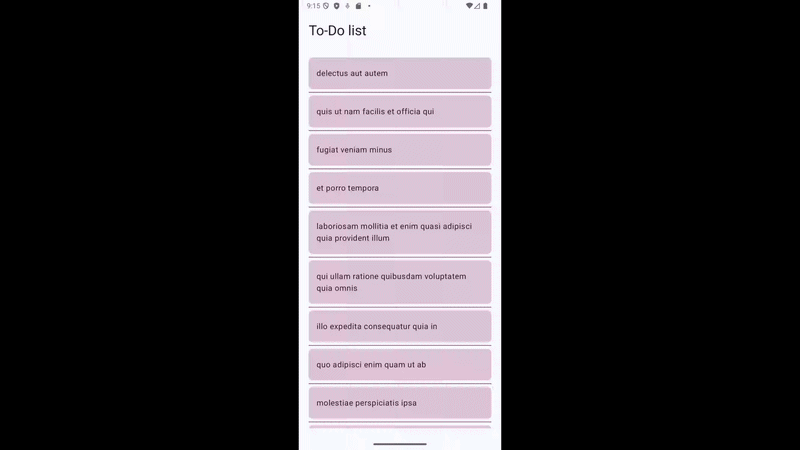

# To-Do 
This is simple Android app that displays to-do list. List data is retrieved through API which
return items as JSON data (https://jsonplaceholder.typicode.com/todos). Implemented with **Kotlin + Jetpack Compose**.
**Retrofit** is used for API calls and **Gson** is used for data conversion (JSON
into Kotlin objects).

## Demo

 


## Running the app

This project was created using **Android Studio**. To clone and open the project:
```bash 

git clone https://github.com/Anniina-55/ToDo-android-app.git
cd ToDo-android-app

- open and run the project in Android Studio
  -> UI should render on emulator and connected physical devices


